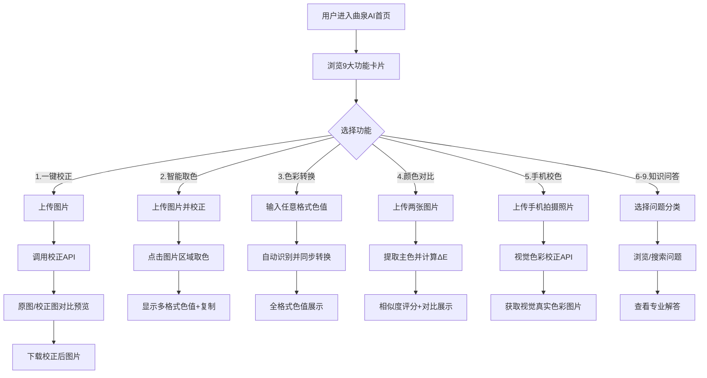

## 1. 产品概述

曲泉AI是一款专注于色彩处理的智能体应用，面向设计师、摄影师、工业胶水从业者等需要精确色彩管理的用户群体。提供一键图片校色、智能取色、色彩空间转换、颜色相似度对比、手机拍摄校色等核心功能，并附带色彩知识问答、行业资讯等增值服务。

- 核心价值：让色彩更精准，让专业色彩处理触手可及
- 目标用户：设计师、摄影师、印刷从业者、工业胶水行业人员、色彩爱好者

## 2. 核心功能

### 2.1 用户角色

| 角色 | 注册方式 | 核心权限 |
|------|---------|---------|
| 普通用户 | 直接访问 | 使用所有功能模块，上传/处理图片，查询知识问答 |

### 2.2 功能模块

1. **首页/导航**：品牌展示区、功能导航卡片、快捷入口
2. **图片一键校正**：上传图片 → AI校正 → 预览下载
3. **智能取色器**：上传图片 → 校正 → 点击取色 → 多格式色值输出
4. **色彩空间转换**：支持RGB/HEX/CMYK/HSL/HSV/Lab等互转
5. **颜色相似度对比**：上传两张图片 → 提取主色 → 相似度评分
6. **手机拍摄校色**：上传手机照片 → 视觉色彩校正 → 输出
7. **色彩知识问答**：常见拍照偏色问题解答、拍照技巧、商铺信息、品牌大全

### 2.3 页面详情

| 页面名称 | 模块名称 | 功能描述 |
|---------|---------|---------|
| 首页 | Hero品牌区 | 曲泉AI品牌展示、Slogan、主色调视觉、渐入动画 |
| 首页 | 功能导航卡片 | 9宫格卡片式导航，hover动效，点击跳转对应模块 |
| 图片校正页 | 上传区 | 拖拽/点击上传，支持jpg/png/webp，上传进度条 |
| 图片校正页 | 校正对比区 | 原图vs校正后左右对比滑块，一键下载按钮 |
| 智能取色页 | 图片展示区 | 校正后图片，点击任意位置显示十字取色器 |
| 智能取色页 | 色值面板 | 实时显示HEX/RGB/HSL/CMYK/Lab色值，支持复制 |
| 色彩转换页 | 输入面板 | 色值输入框，支持格式自动识别 |
| 色彩转换页 | 输出面板 | 所有色彩空间值同步转换显示，一键复制 |
| 颜色对比页 | 双图上传 | 两张图片分别上传，主色提取 |
| 颜色对比页 | 相似度结果 | 颜色差值(ΔE)、相似度百分比、色卡对比 |
| 手机校色页 | 上传处理 | 上传手机照片，模拟人眼视觉校正 |
| 知识问答页 | 问题分类Tab | 偏色原因/拍照技巧/附近商铺/品牌大全四分类 |
| 知识问答页 | 问答列表 | 卡片式展开收起，搜索过滤 |

## 3. 核心流程

## 4. 用户界面设计

### 4.1 设计风格

**设计基调：专业科技感 × 色彩艺术感**

- **主色调**：深邃青蓝 `#0E4D64`（曲泉之水）作为品牌主色，传递专业、信赖感
- **辅助色**：活力橙 `#FF6B35` 作为交互强调色，用于按钮、重要提示
- **渐变色**：色彩光谱渐变 `linear-gradient(135deg, #FF6B35 → #F7C59F → #0E4D64 → #4ECDC4)` 贯穿全局，呼应色彩主题
- **背景**：深石墨灰 `#1A1A2E` 深色模式为主，搭配磨砂玻璃拟态卡片
- **按钮风格**：圆角12px，带微光悬浮效果，主按钮用渐变边框
- **字体**：标题用 `Noto Serif SC` 衬线体（体现曲泉文化底蕴），正文用 `Noto Sans SC`
- **布局**：顶部导航 + 卡片式内容区，大量留白，层次分明
- **图标风格**：Lucide 线性图标，统一2px描边，配合色彩渐变点缀
- **动效**：页面加载时色彩渐变流动，卡片悬停3D微翻转，取色时光标涟漪

### 4.2 页面设计概览

| 页面名称 | 模块名称 | UI元素 |
|---------|---------|--------|
| 首页 | Hero品牌区 | 全屏渐变背景、品牌名"曲泉AI"大字衬线、Slogan副标题、彩色粒子动画 |
| 首页 | 功能导航区 | 3×3卡片网格、图标+标题+简述、hover时卡片上浮+彩色边框发光 |
| 图片校正页 | 上传处理区 | 虚线边框上传区、拖拽提示、处理进度环形加载、左右滑动对比器 |
| 智能取色页 | 取色交互区 | 全屏图片画布、十字取色光标、磁吸色值面板、色值复制成功提示 |
| 色彩转换页 | 转换面板 | 大号色值输入框、色彩预览方块、6种格式色值表格、一键复制全部 |
| 颜色对比页 | 双图对比 | 左右两栏上传卡、主色提取色条、ΔE数值仪表盘、相似度进度环 |
| 知识问答页 | Tab分类导航 | 胶囊Tab切换、卡片折叠展开、搜索框高亮匹配、彩色标签分类 |

### 4.3 响应式

- **桌面优先**：1440px基准设计，最大内容宽度1200px居中
- **平板适配**：1024px断点，导航折叠为汉堡菜单，功能卡片改为2列
- **手机适配**：768px断点，功能卡片改为单列，图片处理区全屏宽度，触摸操作优化取色精度
- **触摸优化**：按钮最小44×44px触控区，取色支持长按放大预览

### 4.4 视觉细节增强

- 全局背景叠加噪点纹理（noise），增加质感
- 功能卡片采用 `backdrop-filter: blur(16px)` 磨砂玻璃效果
- 色彩主题装饰：页面边角点缀光谱渐变光斑
- 滚动触发渐入动画，元素交错出现（staggered reveal）
- 深色模式下文字采用 `#E8E8F0` 浅灰白，避免纯白刺眼
