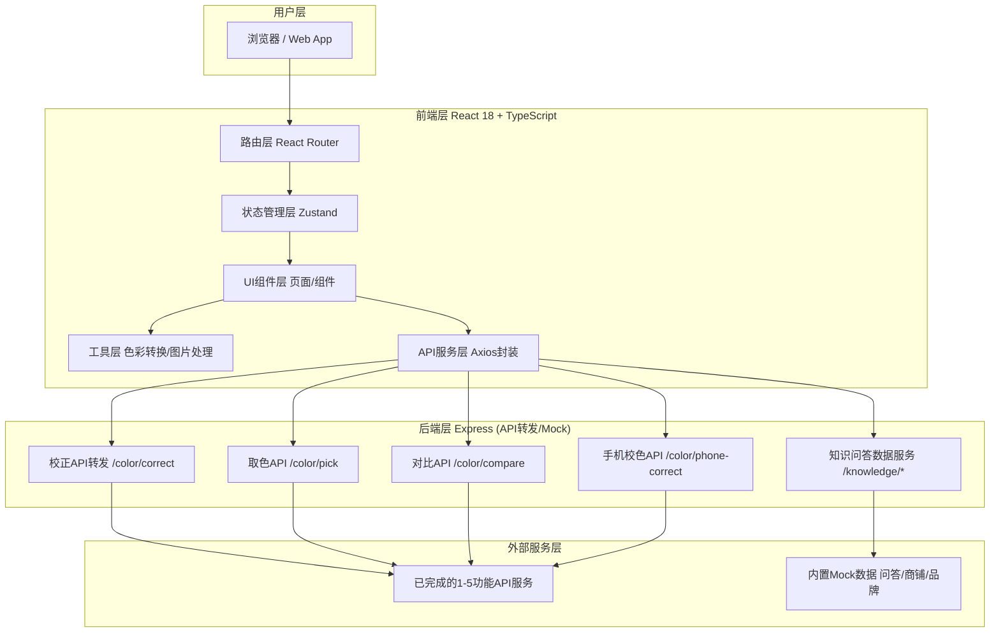
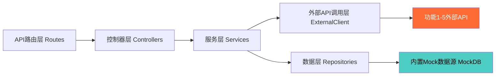
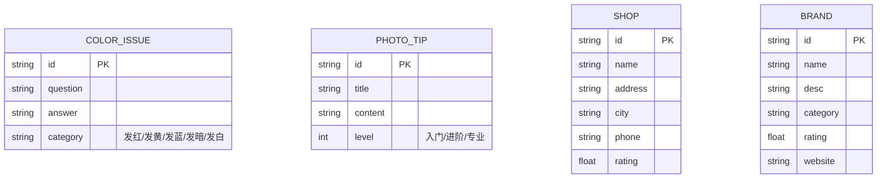

## 1. 架构设计



## 2. 技术描述

- **前端框架**：React@18 + TypeScript@5
- **构建工具**：Vite@5
- **样式方案**：Tailwind CSS@3 + CSS Variables + 自定义动画
- **路由管理**：react-router-dom@6
- **状态管理**：zustand@4
- **HTTP客户端**：axios@1.6
- **图标库**：lucide-react@0.312
- **后端框架**：Express@4 + TypeScript（用于API转发和知识问答服务）
- **初始化方案**：react-express-ts 模板（前后端一体项目）
- **包管理器**：pnpm（优先）/ npm

## 3. 路由定义

| 路由路径 | 页面名称 | 功能说明 |
|---------|---------|---------|
| `/` | 首页 Home | 品牌展示 + 9大功能导航卡片 |
| `/image-correction` | 图片一键校正 | 上传图片 → AI校正 → 对比预览下载 |
| `/color-picker` | 智能取色器 | 校正后图片点击取色，多格式色值 |
| `/color-converter` | 色彩空间转换 | 6种色彩空间互转 |
| `/color-compare` | 颜色相似度对比 | 双图主色提取，ΔE相似度计算 |
| `/phone-correction` | 手机拍摄校色 | 手机照片视觉校正 |
| `/knowledge` | 色彩知识问答 | 4大分类：偏色原因/拍照技巧/商铺/品牌 |

## 4. API 定义（前后端接口契约）

### 4.1 功能1 - 图片一键校正
```typescript
// POST /api/color/correct
// Request: multipart/form-data
interface CorrectRequest {
  image: File;              // 原始图片
  mode?: 'auto' | 'nature' | 'portrait' | 'product';  // 校正模式
}
// Response
interface CorrectResponse {
  success: boolean;
  originalUrl: string;      // 原图URL
  correctedUrl: string;     // 校正后图URL
  meta: {
    brightnessDiff: number;
    contrastDiff: number;
    saturationDiff: number;
    whiteBalanceShift: 'warm' | 'cool' | 'neutral';
  };
}
```

### 4.2 功能2 - 智能取色
```typescript
// POST /api/color/pick
interface PickRequest {
  imageUrl: string;         // 已校正图片URL
  x: number;                // 点击x坐标(百分比0-100)
  y: number;                // 点击y坐标(百分比0-100)
}
interface PickResponse {
  success: boolean;
  color: {
    hex: string;            // #FF6B35
    rgb: { r: number; g: number; b: number };
    hsl: { h: number; s: number; l: number };
    cmyk: { c: number; m: number; y: number; k: number };
    lab: { l: number; a: number; b: number };
    hsv: { h: number; s: number; v: number };
  };
  colorName?: string;       // 色彩名称（近似中文命名）
}
```

### 4.3 功能3 - 色彩空间转换（前端内置，无需API）
```typescript
// 前端工具函数 utils/colorConverter.ts
function convertColor(input: ColorInput): FullColorValues;
interface ColorInput {
  format: 'hex' | 'rgb' | 'hsl' | 'cmyk' | 'lab' | 'hsv';
  value: string | object;
}
```

### 4.4 功能4 - 颜色相似度对比
```typescript
// POST /api/color/compare
interface CompareRequest {
  imageA: File;             // 实物图A
  imageB: File;             // 实物图B
}
interface CompareResponse {
  success: boolean;
  similarity: {
    deltaE: number;         // ΔE2000色差
    percent: number;        // 相似度百分比 0-100
    level: '极高' | '高' | '中' | '低' | '极低';
  };
  dominantColorsA: string[];  // A图主色HEX数组
  dominantColorsB: string[];  // B图主色HEX数组
}
```

### 4.5 功能5 - 手机拍摄校色
```typescript
// POST /api/color/phone-correct
interface PhoneCorrectRequest {
  image: File;
  device?: 'iphone' | 'android' | 'auto';
  scene?: 'outdoor' | 'indoor' | 'studio' | 'night';
}
interface PhoneCorrectResponse {
  success: boolean;
  originalUrl: string;
  correctedUrl: string;
  adjustment: {
    redShift: number;
    greenShift: number;
    blueShift: number;
    brightness: number;
    exposure: number;
  };
}
```

### 4.6 知识问答服务（内置Mock）
```typescript
// GET /api/knowledge/color-issues?keyword=发红
// GET /api/knowledge/photo-tips
// GET /api/knowledge/shops?city=深圳
// GET /api/knowledge/brands?category=玻璃胶
interface QAItem {
  id: string;
  question: string;
  answer: string;
  tags: string[];
}
interface Shop {
  id: string;
  name: string;
  address: string;
  city: string;
  phone: string;
  products: string[];
  rating: number;
}
interface Brand {
  id: string;
  name: string;
  logo?: string;
  category: string[];     // 工业颜色胶/胶粘剂/玻璃胶
  desc: string;
  website?: string;
  rating: number;
}
```

## 5. 服务端架构图



## 6. 数据模型（知识问答内置数据）

### 6.1 ER 图


### 6.2 初始化Mock数据
- COLOR_ISSUE: 至少15条（发红3条、发黄3条、发蓝2条、发暗3条、发白2条、其他2条）
- PHOTO_TIP: 至少10条（覆盖光线、白平衡、设备设置、后期等）
- SHOP: 至少20家（按深圳/上海/广州/北京/杭州5城市分布）
- BRAND: 至少15个（覆盖道康宁/瓦克/汉高/回天/之江/硅宝等主流品牌）
